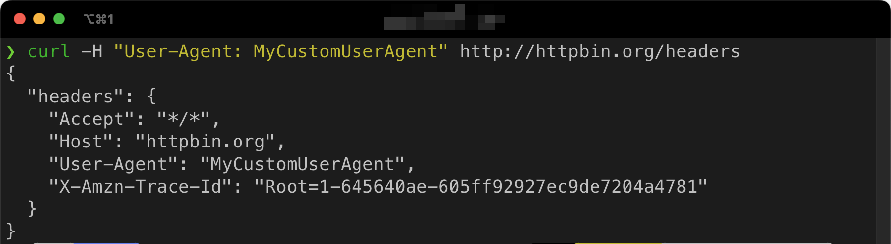
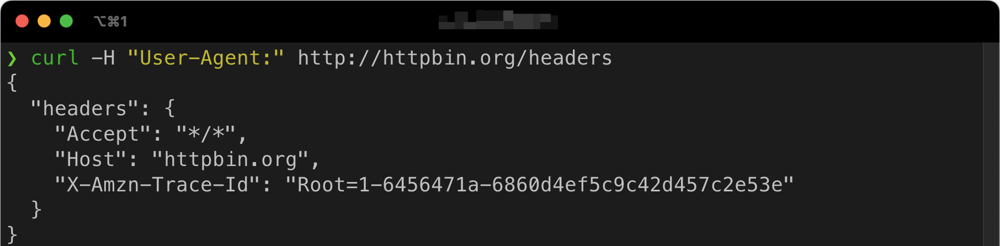

# Sending HTTP Headers With cURL


[](https://oxylabs.go2cloud.org/aff_c?offer_id=7&aff_id=877&url_id=112)


[](https://github.com/topics/curl) [](https://github.com/topics/headers)

- [Sending HTTP headers](#sending-http-headers)
- [Sending custom HTTP headers](#sending-custom-http-headers)
- [Sending multiple headers](#sending-multiple-headers)
- [Get/show HTTP headers](#getshow-http-headers)
- [Advanced tips for working with cURL headers](#advanced-tips-for-working-with-curl-headers)
- [FAQ](#faq)

In this guide, you’ll learn how to send and receive HTTP headers using cURL, a versatile command-line tool for transferring data with URL syntax.

## Sending HTTP headers

HTTP headers consist of a name-value pair, separated by a colon – `:`. The name identifies the type of information sent, while the value is the actual data.

Some of the most common HTTP headers include User-Agent, Content-Type, Accept, and Cache-Control.

When you send an HTTP request with cURL, it sends the following headers by default:

- `Host: example.com`
- `user-agent: curl/7.87.0`
- `accept: */*`

You can change the value of these headers when sending a request.

To send HTTP headers with cURL, you can use the `-H` or `--header` option followed by the header name and value in the format `"Header-Name: value"`.

```sh
curl -H "User-Agent: MyCustomUserAgent" http://httpbin.org/headers
```

In the example below, a custom User-Agent header is sent as `"MyCustomUserAgent"` when requesting the http://httpbin.org/headers page.



The http://httpbin.org/headers page is meant for testing as it returns a JSON file with all the headers it found in the request. Ignore the `X-Amzn` header that this site uses internally.

## Sending custom HTTP headers

To send custom HTTP headers with cURL, use the `-H` option and provide the header name and value.

```sh
curl -H "Authorization: Bearer my-access-token" http://httpbin.org/headers
```

## Sending multiple headers

To send multiple headers with cURL, you can use the `-H` option multiple times in the same command.

```sh
curl -H "User-Agent: MyCustomUserAgent" -H "Accept:application/json" http://httpbin.org/headers
```

## Get/show HTTP headers

To view the response headers from a web server, you can use the `-I` or `--head` option with cURL.

```sh
curl -I http://httpbin.org/headers
curl --head http://httpbin.org/headers
```

You can also use the `-i` or `--include` option to show both the response headers and the content in the output.

```sh
curl -i http://httpbin.org/headers
curl --include http://httpbin.org/headers
```

## Advanced tips for working with cURL headers

### Sending empty headers

```sh
curl -H "User-Agent;" http://httpbin.org/headers
```

### Removing headers

```sh
curl -H "User-Agent:" http://httpbin.org/headers
```



### Verbose mode

If you want to see more detailed information about the request and response, including the headers sent and received, you can use the `-v` or `--verbose` option.

```sh
curl -v http://httpbin.org/headers
curl --verbose http://httpbin.org/headers
```

### Saving headers to a file

```sh
curl -D headers.txt -o content.txt http://httpbin.org/headers
```

## FAQ

### How to add headers in cURL?

```sh
curl -H "User-Agent: MyCustomUserAgent" http://httpbin.org/headers
```

### Does cURL automatically add headers?

Yes, cURL automatically adds standard headers, such as User-Agent, Accept, and Host, based on the request type and other options. You can override or add custom headers using the `-H` command.

### How to check HTTP headers in cURL?

To check HTTP headers in cURL, use the `-I` or `--head` option to only retrieve headers without the actual content.

```sh
curl -I http://httpbin.org/headers
```

Alternatively, you can use the `-i` or `--include` option to show both the response headers and content in the output.

```sh
curl -i http://httpbin.org/headers
```

### How to send empty headers with cURL?

```sh
curl -H "User-Agent;" http://httpbin.org/headers
```

### How to remove a default header in cURL?

To remove a header that cURL adds by default, provide the header name followed by a colon without a value. For example, to remove the User-Agent header:

```sh
curl -H "User-Agent:" http://httpbin.org/headers
```
